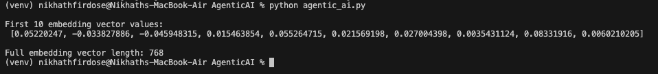

# AgenticAI - Gemini Version

A simple Python script to read a `.txt` document and summarize its content using Google's Gemini API.

## 1. Setup

```bash
git clone <your-repo-url>
cd AgenticAI
```


Create a .env file with your Gemini API key:

```bash
GOOGLE_API_KEY=your_actual_gemini_api_key

```

## 2. Setup and Run
```bash
chmod +x setup.sh
./setup.sh

```

This will:

1. Create a virtual environment

2. Activate it

3. Install all required packages


## 3. Run
```bash
source venv/bin/activate
python agentic_ai.py
```

Note: make sure .env file is NOT committed to GitHub

## 4 Output

The terminal will print a prompt and a Gemini-generated summary of your document.

